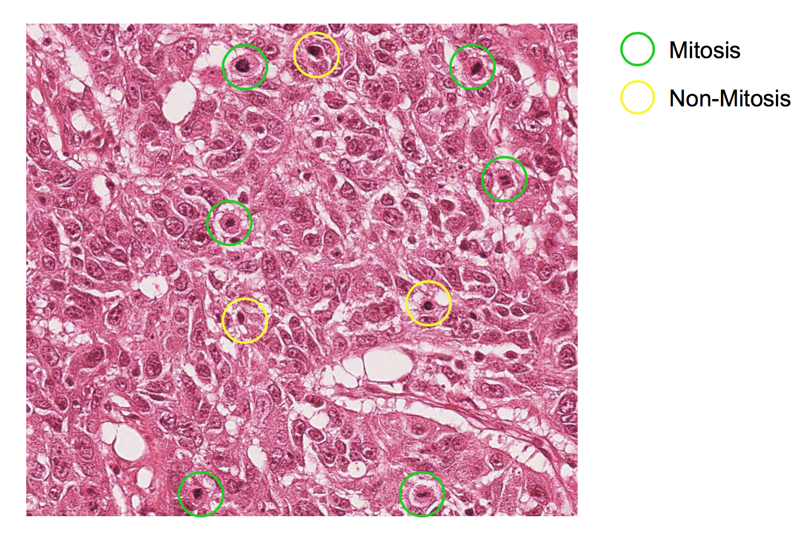
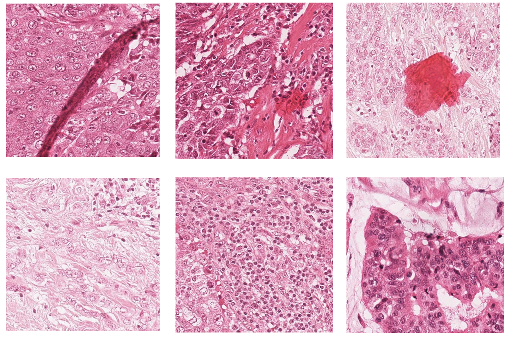

### Project Title: Mitosis Detection in Breast Cancer Histology Images

## Project Description:
Breast cancer grading plays an important role in predicting the aggressiveness of the disease. A key component in breast cancer grading is mitosis count (quantifying the number of cells in the process of diving at a given time). Currently, pathologists in the labs manually detect and count mitosis.

The goal of this project is to bring the power of machine learning to the field of pathology and provide a consistent tool and diagnostic aid that relieves pathologists of this tedious task. 

 

In this project, I leverage digital pathology images and convolutional neural networks to learn features of cells undergoing mitosis and detect them.

# 1. Classification
This approach detects mitotic cells and non-mitotic cells that might be indistinguishable to the human eye.

# 2. Stain Variation
This approach attempts to handle staining variation across different samples

 

## Image Source:
    ICPR 2014 Contest
    This contest is supported in part by the French National Research Agency ANR, project MICO under reference
    ANR-10-TECS-015, and by the Fondation AVEC (Association Vivons Ensemble avec le Cancer)

## Code:
    Look at code/README
